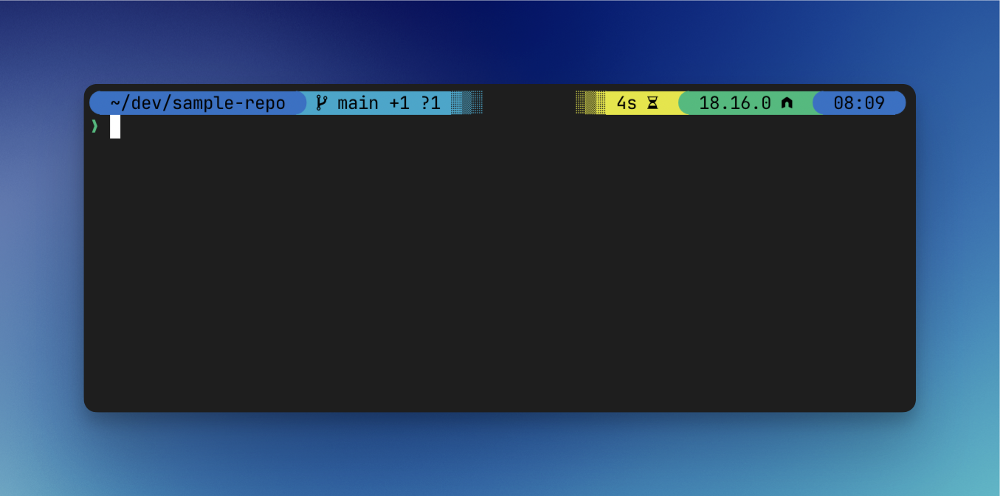

# denolfe's dotfiles

[](https://github.com/denolfe/dotfiles/actions)
[![Powered by dotbot][dbshield]][dblink]

[dblink]: https://github.com/anishathalye/dotbot
[dbshield]: https://img.shields.io/badge/powered%20by-dotbot-blue?style=flat

> Personal dotfiles configuration



| Component                     | Tool                                                      | Config                                   |
| ----------------------------- | --------------------------------------------------------- | ---------------------------------------- |
| Installation                  | [Dotbot](https://github.com/anishathalye/dotbot)          | [install.conf.yaml](./install.conf.yaml) |
| Terminal                      | [Ghostty](https://ghostty.org)                            | [config](./ghostty/config)               |
| Theme                         | [Powerlevel10k](https://github.com/romkatv/powerlevel10k) | [p10k.zsh](./zsh/p10k.zsh)               |
| .zshrc                        | [oh-my-zsh](https://github.com/robbyrussell/oh-my-zsh)    | [.zshrc](./zsh/zshrc.zsh)                |
| Global Key Rebinds, Hyper Key | [Karabiner](https://karabiner-elements.pqrs.org/)         | [karabiner.ts](./karabiner/karabiner.ts) |
| App Focus, Window Management  | [Phoenix](https://kasper.github.io/phoenix/)              | [phoenix.ts](./phoenix/src/phoenix.ts)   |

## [Makefile](./Makefile)

- Install with dotbot
- Homebrew save/restore
- VS Code extension save/restore
- Karabiner config compilation
- Phoenix config compilation
- Install MacOS defaults

## Keyboard Mappings

### Hyper Key modifier

- <kbd>CapsLock</kbd>
- <kbd>CapsLock</kbd>+<kbd>cmd</kbd>

### Directional Bindings (<kbd>CapsLock</kbd>) w/ Selection (+<kbd>cmd</kbd>)

- <kbd>h</kbd><kbd>j</kbd><kbd>k</kbd><kbd>l</kbd> - VIM arrows
- <kbd>m</kbd> - Left one word
- <kbd>.</kbd> - Right one word
- <kbd>n</kbd> - Home
- <kbd>p</kbd> - End
- <kbd>i</kbd> - Page Up
- <kbd>u</kbd> - Page Down
- <kbd>cmd</kbd>+<kbd>i</kbd> - Top of page
- <kbd>cmd</kbd>+<kbd>u</kbd> - End of page

### Remappings

- <kbd>CapsLock</kbd>+<kbd>delete</kbd> - Forward delete
- <kbd>CapsLock</kbd>+<kbd>cmd</kbd>+<kbd>delete</kbd> - Forward delete word
- <kbd>CapsLock</kbd>+<kbd>a</kbd> - Spaces left
- <kbd>CapsLock</kbd>+<kbd>d</kbd> - Spaces right
- <kbd>CapsLock</kbd>+<kbd>s</kbd> - Mission Control
- <kbd>CapsLock</kbd> +<kbd>cmd</kbd>+<kbd>s</kbd> - Show all app windows

## Phoenix

### Window Launch or Focus

- <kbd>CapsLock</kbd>+<kbd>;</kbd> - Ghostty
- <kbd>CapsLock</kbd>+<kbd>g</kbd> - Google Chrome
- <kbd>CapsLock</kbd>+<kbd>c</kbd> - Visual Studio Code
- <kbd>CapsLock</kbd>+<kbd>f</kbd> - Slack
- <kbd>CapsLock</kbd>+<kbd>v</kbd> - Spotify

### Window Manager

- Dual Window splitting, resize other window to fit
  - <kbd>CapsLock</kbd>+<kbd>q</kbd> - Chained: 60%, 50%, 40%, 33%, 66%
  - <kbd>CapsLock</kbd>+<kbd>e</kbd> - Chained: 40%, 50%, 60%, 66%, 33%
  - <kbd>CapsLock</kbd>+<kbd>w</kbd> - Chained: full, centeredBig, centeredMedium, centeredSmall

- <kbd>CapsLock</kbd>+<kbd>tab</kbd> - Move window to next screen

## Usage

*Prerequisites: python, git, zsh*

### Installation

```sh
git clone git@github.com:denolfe/dotfiles.git .dotfiles --recursive
cd .dotfiles
make install
```

### Other Tasks

*[See Makefile](./Makefile)*
