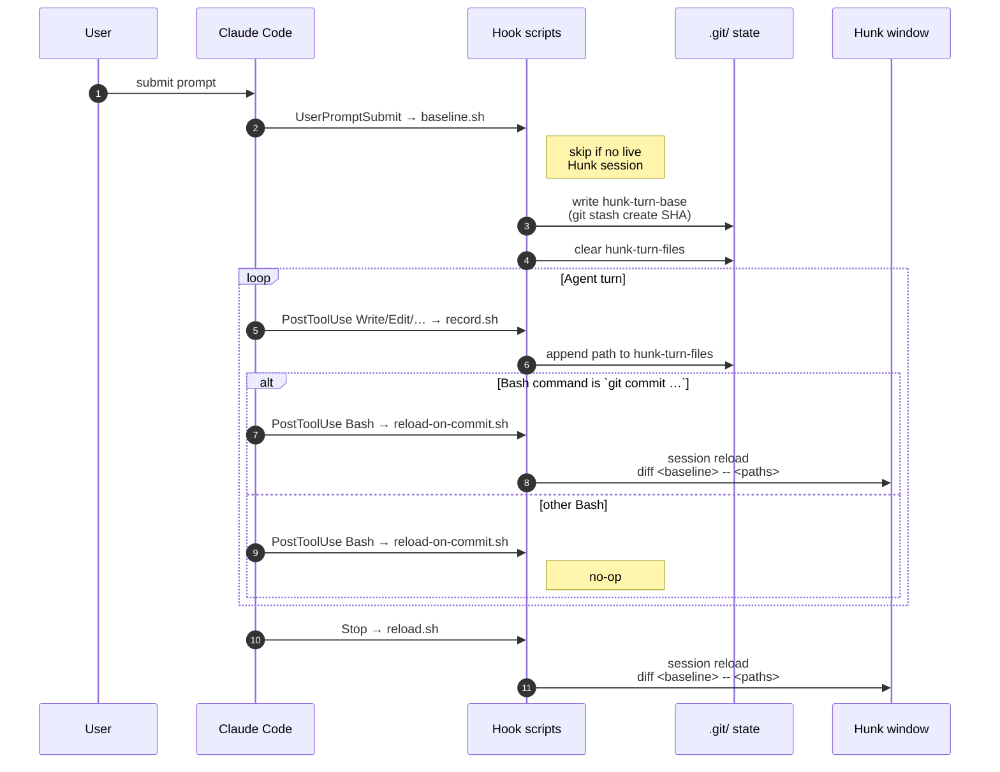

# hunk-turn-review

Keeps a live [Hunk](https://github.com/modem-dev/hunk) diff session focused on
**what the current agent turn changed** — edited and newly-created files,
without the noise of pre-existing untracked directories.

## Usage

In a git repo, launch a Hunk window once (it stays open):

```bash
hunk diff --watch
```

Then work normally. At the end of every turn — and after every mid-turn
`git commit` — the window re-points to that turn's diff. The launch args
don't matter; the hooks overwrite them.

## Flow



## Hooks

| Event | Script | Action |
| --- | --- | --- |
| `UserPromptSubmit` | `baseline.sh` | Snapshots tracked state (`git stash create`, non-destructive) as the turn baseline; resets the touched-file list. No-ops unless a Hunk session is open for the repo. |
| `PostToolUse` (Write/Edit/MultiEdit/NotebookEdit) | `record.sh` | Appends each touched path to the turn's list. |
| `PostToolUse` (Bash, matches `git commit`) | `reload-on-commit.sh` | Reloads Hunk mid-turn so each commit's cumulative diff is visible without waiting for `Stop`. |
| `Stop` | `reload.sh` | `hunk session reload --repo <root> -- diff <baseline> -- <touched paths>`. |

The baseline is set **once per turn** at `UserPromptSubmit`. Every reload —
mid-turn or at `Stop` — shows the cumulative `baseline → worktree` diff, which
spans any commits made during the turn (HEAD moves, baseline doesn't).

Pathspec scoping is what lets agent-created (untracked) files appear while the
large untracked dirs stay out — `--exclude-untracked` would hide new files, so
it's intentionally not used.

## State

Per repo, auto-pruned by `git gc` since nothing refs the snapshots:

```
<repo>/.git/hunk-turn-base    # baseline commit SHA
<repo>/.git/hunk-turn-files   # paths touched this turn
```

## Limitations

- Files created via Bash (`>`, `touch`, `mv`) aren't recorded — no
  `PostToolUse` Write/Edit fires for them. Most agent file creation goes
  through the Write tool.
- The Hunk window must be open **before** the prompt for that turn to be
  baselined. Open Hunk first, then prompt; otherwise the next turn picks it up.
- Requires `hunk`, `git`, and `jq` on `PATH`.
