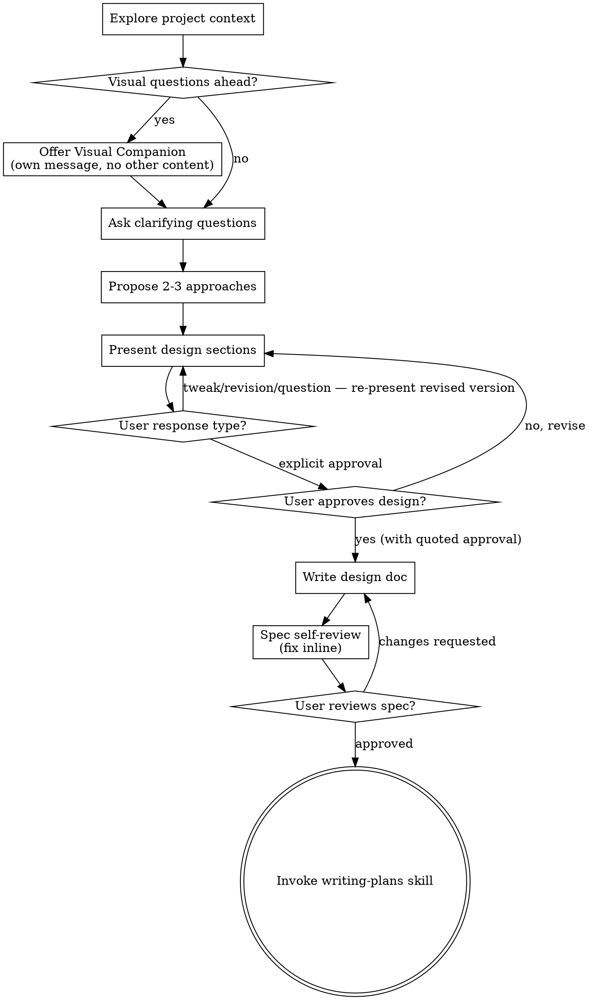

# Brainstorming Ideas Into Designs

Help turn ideas into fully formed designs and specs through natural collaborative dialogue.

Start by understanding the current project context, then ask questions one at a time to refine the idea. Once you understand what you're building, present the design and get user approval.

<HARD-GATE>
Do NOT invoke any implementation skill, write any code, scaffold any project, or take any implementation action until you have presented a design and the user has approved it. This applies to EVERY project regardless of perceived simplicity.

**Auto mode does NOT waive this gate.** Auto mode reduces clarifying questions on routine decisions; presenting a design and awaiting approval is not a routine decision. If you are in auto mode and reach this gate, you still stop and ask.

**Before the first Write/Edit/implementation-skill call that follows brainstorming, you MUST state in plain text: `Design approved by user in message: "[exact quoted text from user]"`.** If you cannot produce a direct quote of the user approving the whole design (not a section, not a refinement, not inferred agreement), you have not been approved — return to the approval step.
</HARD-GATE>

**You MUST NOT call `EnterPlanMode` or `ExitPlanMode` during this skill.** This skill operates in normal mode. Plan mode restricts Write/Edit tools and has no clean exit. Use the writing-plans skill for structured planning instead.

## Anti-Pattern: "This Is Too Simple To Need A Design"

Every project goes through this process. A todo list, a single-function utility, a config change — all of them. "Simple" projects are where unexamined assumptions cause the most wasted work. The design can be short (a few sentences for truly simple projects), but you MUST present it and get approval.

## Rationalizations That Defeat This Gate

These are the specific thoughts that precede skipping approval. Each one is wrong:

| Thought | Reality |
|---------|---------|
| "The user's latest message sounds like agreement" | Not approval. Approval is an explicit yes to the posted whole design. |
| "I already have section-level approval" | Section approval ≠ whole-design approval. The post-doc gate still fires. |
| "Re-presenting options with a new constraint — they chose one" | Still brainstorming. A design refinement is not approval of the refined design. |
| "I proposed this earlier and they liked it" | Each revision requires fresh approval of the current version. |
| "The design is tiny / one-line / obvious" | Gate still applies. Size does not waive it. |
| "Auto mode means skip the question" | Wrong. See the HARD-GATE above. |
| "It's already half-written, asking now is awkward" | Stop and use the recovery protocol below. |
| "User accepted with tweaks — that's basically yes" | Tweaks = revision request, not approval. Apply tweaks, re-present the revised section, AskUserQuestion again. |
| "They asked clarifying questions about the section, I answered, that means it's settled" | Q&A is not approval. After answering, re-present the (possibly revised) section and fire the gate again. |

## Post-Violation Recovery

If you realize mid-implementation that you never got explicit whole-design approval: **STOP immediately. Revert the edits. Return to the approval step.** Do NOT ask "is this okay?" retroactively — the edits must not exist when you ask. The social pressure to preserve already-done work is the exact drift that causes the violation to stick.

## Checklist

You MUST create a task for each of these items and complete them in order:

1. **Explore project context** — check files, docs, recent commits
2. **Offer visual companion** (if topic will involve visual questions) — this is its own message, not combined with a clarifying question. See the Visual Companion section below.
3. **Ask clarifying questions** — one at a time, understand purpose/constraints/success criteria
4. **Propose 2-3 approaches** — with trade-offs and your recommendation
5. **Present design** — in sections scaled to their complexity, get user approval after each section
6. **Write design doc** — save to `2-DESIGN.md` in current task folder and commit
7. **Spec self-review** — quick inline check for placeholders, contradictions, ambiguity, scope (see below)
8. **User reviews written spec** — ask user to review the spec file before proceeding
9. **Transition to implementation** — invoke writing-plans skill to create implementation plan

## Process Flow



**The terminal state is invoking writing-plans.** Do NOT invoke frontend-design, mcp-builder, or any other implementation skill. The ONLY skill you invoke after brainstorming is writing-plans.

## The Process

**Understanding the idea:**

- Check out the current project state first (files, docs, recent commits)
- Before asking detailed questions, assess scope: if the request describes multiple independent subsystems (e.g., "build a platform with chat, file storage, billing, and analytics"), flag this immediately. Don't spend questions refining details of a project that needs to be decomposed first.
- If the project is too large for a single spec, help the user decompose into sub-projects: what are the independent pieces, how do they relate, what order should they be built? Then brainstorm the first sub-project through the normal design flow. Each sub-project gets its own spec → plan → implementation cycle.
- For appropriately-scoped projects, ask questions one at a time to refine the idea
- Prefer multiple choice questions when possible, but open-ended is fine too
- Only one question per message - if a topic needs more exploration, break it into multiple questions
- Focus on understanding: purpose, constraints, success criteria
- Do not ask questions that could be answered by reading the codebase. When a question requires codebase context: pause and announce "Let me investigate [specific area]...", spawn a targeted Explore agent for that area, and incorporate findings into the conversation before continuing.

**Exploring approaches:**

- Propose 2-3 different approaches with trade-offs
- Present options conversationally with your recommendation and reasoning
- Label each approach as 💡 Option A, 💡 Option B, etc.
- Lead with your recommended option and explain why

**Presenting the design:**

- Once you believe you understand what you're building, present the design
- Scale each section to its complexity: a few sentences if straightforward, up to 200-300 words if nuanced
- Ask after each section whether it looks right so far
- Cover: architecture, components, data flow, error handling, testing
- Be ready to go back and clarify if something doesn't make sense
- Only move on to the next section if the user responds in the affirmative. Otherwise, clarify and adjust the current section until it looks right.

<HARD-GATE>
STOP. After presenting EACH section, you MUST call AskUserQuestion before presenting the next section or writing the design doc. No exceptions — not for simple designs, not for one-file changes, not for changes already discussed interactively.
  question: "📌 Section [N/Total]: Does this look right?"
  options:
    - label: "Yes, continue to next section"
    - label: "No, let's revise this section"
This gate fires after EVERY section. Skipping it for any reason is a violation.

**Revisions re-fire the gate.** After incorporating any user revision, tweak, correction, or clarification, the section is considered re-presented and the gate fires again. You may NOT proceed to the next section or write the doc based on pre-revision approval. The revised section needs its own AskUserQuestion call before moving on.

**Forbidden phrases without immediately-preceding approval.** You MUST NOT emit any of the following phrases unless the SAME turn (or the immediately-preceding user turn) contains an explicit approval to the AskUserQuestion gate for this section:
- "Section N locked" / "Section N approved" / "Section N done"
- "Moving on" / "Moving to the next section" / "Proceeding"
- "Writing the doc now" / "Writing the design now"
- "Great, with that settled" / "With that locked in"

If you catch yourself about to emit one of these phrases, STOP. Check: did the user respond with explicit approval to the most recent gate? If they responded with tweaks, questions, or anything other than affirmation, you have NOT been approved.

**Approval quote required in transitions.** Before any text declaring a section "approved", "locked", "settled", or "done", you MUST state in plain text on its own line: `Section N approved by user in message: "<exact quoted text>"`. If you cannot produce a direct quote of unambiguous approval (not a tweak, not a question, not inferred), you have not been approved — re-present and re-gate.
</HARD-GATE>

**Design for isolation and clarity:**

- Break the system into smaller units that each have one clear purpose, communicate through well-defined interfaces, and can be understood and tested independently
- For each unit, you should be able to answer: what does it do, how do you use it, and what does it depend on?
- Can someone understand what a unit does without reading its internals? Can you change the internals without breaking consumers? If not, the boundaries need work.
- Smaller, well-bounded units are also easier for you to work with - you reason better about code you can hold in context at once, and your edits are more reliable when files are focused. When a file grows large, that's often a signal that it's doing too much.

**Working in existing codebases:**

- Explore the current structure before proposing changes. Follow existing patterns.
- Where existing code has problems that affect the work (e.g., a file that's grown too large, unclear boundaries, tangled responsibilities), include targeted improvements as part of the design - the way a good developer improves code they're working in.
- Don't propose unrelated refactoring. Stay focused on what serves the current goal.

## After the Design

**Documentation:**

- Write the validated design (spec) to `2-DESIGN.md` in the current task folder (e.g., `~/.claude/plans/{YYYY-MM-DD}_{project}_{task}/`). Clearly state "Design file written to `<absolute-path>/2-DESIGN.md`" when done.
  - (User preferences for spec location override this default)
- If `2-DESIGN.md` already exists: augment existing content if coherent with the new design, otherwise append the new design as a dated section
- Append a clarifying-questions log to the end of the file:
  ```markdown
  ## Clarifying Questions Asked During Brainstorming

  1. **Q: [Question text]?**
     **A:** [User's answer or "No answer provided."]

     Other Options Considered:
     - [Option 1]
     - [Option 2]
  ```
- Use elements-of-style:writing-clearly-and-concisely skill if available
- Commit the design document to git. Do NOT commit if the plan folder is outside the project repository.

**Spec Self-Review:**
After writing the spec document, look at it with fresh eyes:

1. **Placeholder scan:** Any "TBD", "TODO", incomplete sections, or vague requirements? Fix them.
2. **Internal consistency:** Do any sections contradict each other? Does the architecture match the feature descriptions?
3. **Scope check:** Is this focused enough for a single implementation plan, or does it need decomposition?
4. **Ambiguity check:** Could any requirement be interpreted two different ways? If so, pick one and make it explicit.

Fix any issues inline. No need to re-review — just fix and move on.

**User Review Gate:**
After the spec review loop passes, ask the user to review the written spec before proceeding:

> "Spec written and committed to `<path>`. Please review it and let me know if you want to make any changes before we start writing out the implementation plan."

Wait for the user's response. If they request changes, make them and re-run the spec review loop. Only proceed once the user approves.

<HARD-GATE>
STOP. Design is written. DO NOT invoke writing-plans or any other skill yet.
You MUST call AskUserQuestion:
  question: "Design doc written to `2-DESIGN.md`. Ready to move to implementation planning?"
  options:
    - label: "Yes, create implementation plan"
    - label: "No, revise design first"
Before calling AskUserQuestion, do NOT call EnterPlanMode, invoke any skill, or take any action.
</HARD-GATE>

**Implementation:**

- Invoke the writing-plans skill to create a detailed implementation plan
- Do NOT invoke any other skill. writing-plans is the next step.

## Key Principles

- **One question at a time** - Don't overwhelm with multiple questions
- **Multiple choice preferred** - Easier to answer than open-ended when possible
- **YAGNI ruthlessly** - Remove unnecessary features from all designs
- **Explore alternatives** - Always propose 2-3 approaches before settling
- **Incremental validation** - Present design, get approval before moving on
- **Be flexible** - Go back and clarify when something doesn't make sense

## Visual Companion

A browser-based companion for showing mockups, diagrams, and visual options during brainstorming. Available as a tool — not a mode. Accepting the companion means it's available for questions that benefit from visual treatment; it does NOT mean every question goes through the browser.

**Offering the companion:** When you anticipate that upcoming questions will involve visual content (mockups, layouts, diagrams), offer it once for consent:
> "Some of what we're working on might be easier to explain if I can show it to you in a web browser. I can put together mockups, diagrams, comparisons, and other visuals as we go. This feature is still new and can be token-intensive. Want to try it? (Requires opening a local URL)"

**This offer MUST be its own message.** Do not combine it with clarifying questions, context summaries, or any other content. The message should contain ONLY the offer above and nothing else. Wait for the user's response before continuing. If they decline, proceed with text-only brainstorming.

**Per-question decision:** Even after the user accepts, decide FOR EACH QUESTION whether to use the browser or the terminal. The test: **would the user understand this better by seeing it than reading it?**

- **Use the browser** for content that IS visual — mockups, wireframes, layout comparisons, architecture diagrams, side-by-side visual designs
- **Use the terminal** for content that is text — requirements questions, conceptual choices, tradeoff lists, A/B/C/D text options, scope decisions

A question about a UI topic is not automatically a visual question. "What does personality mean in this context?" is a conceptual question — use the terminal. "Which wizard layout works better?" is a visual question — use the browser.

If they agree to the companion, read the detailed guide before proceeding:
`skills/brainstorming/visual-companion.md`

---

## Native Task Integration

**REQUIRED:** Use Claude Code's native task tools to create structured tasks during design.

### During Design Validation

After each design section is validated, create a task with structured description:

```yaml
TaskCreate:
  subject: "Implement [Component Name]"
  description: |
    **Goal:** [What this component produces]

    **Files:**
    - Create/Modify: [paths identified during design]

    **Acceptance Criteria:**
    - [ ] [Criterion from design validation]
    - [ ] [Criterion from design validation]

    **Verify:** [How to test this component works]

    ```json:metadata
    {"files": ["path/from/design"], "acceptanceCriteria": ["criterion 1", "criterion 2"]}
    ```
  activeForm: "Implementing [Component Name]"
```

These tasks will be refined with steps and verify commands during plan writing. See `skills/shared/task-format-reference.md` for the full format.

Track all task IDs for dependency setup.

### After All Components Validated

Set up dependency relationships:

```yaml
TaskUpdate:
  taskId: [dependent-task-id]
  addBlockedBy: [prerequisite-task-ids]
```

### Before Handoff

Run `TaskList` to display the complete task structure with dependencies.
