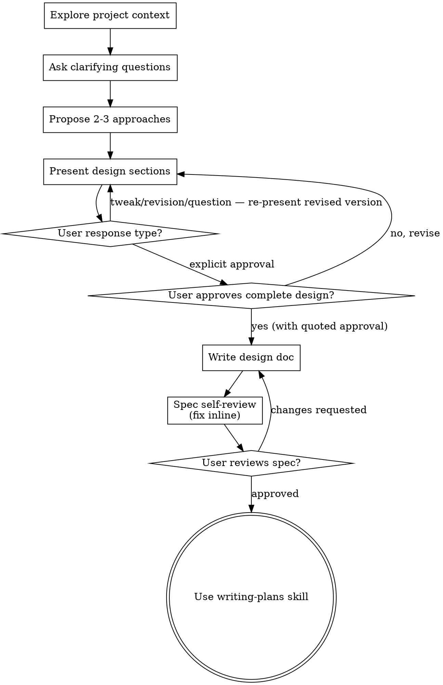

# Brainstorming Ideas Into Designs

Help turn ideas into fully formed designs and specs through natural collaborative dialogue.

Start by understanding the current project context, then ask questions one at a time to refine the idea. Once you understand what you're building, present the design and get explicit user approval.

<HARD-GATE>
Do NOT invoke any implementation skill, write any code, scaffold any project, or take any implementation action until you have presented a design and the user has approved it. This applies to EVERY project regardless of perceived simplicity.

**Auto mode does NOT waive this gate.** Auto mode reduces clarifying questions on routine decisions; presenting a design and awaiting approval is not a routine decision. If you are in auto mode and reach this gate, you still stop and ask.

**Before the first write/edit/implementation-skill call that follows brainstorming, you MUST state in plain text: `Design approved by user in message: "[exact quoted text from user]"`.** If you cannot produce a direct quote of the user approving the whole design, you have not been approved — return to the approval step.
</HARD-GATE>

## Anti-Pattern: "This Is Too Simple To Need A Design"

Every project goes through this process. A todo list, a single-function utility, a config change — all of them. "Simple" projects are where unexamined assumptions cause the most wasted work. The design can be short, but you MUST present it and get approval.

## Rationalizations That Defeat This Gate

| Thought | Reality |
|---------|---------|
| "The user's latest message sounds like agreement" | Not approval. Approval is an explicit yes to the posted whole design. |
| "I already have section-level approval" | Section approval is not whole-design approval. |
| "They chose an option" | Still brainstorming. A choice is not approval of the complete design. |
| "The design is tiny / one-line / obvious" | Gate still applies. Size does not waive it. |
| "Auto mode means skip the question" | Wrong. See the hard gate above. |
| "User accepted with tweaks" | Tweaks are a revision request, not approval. Apply them, re-present the revised section, and ask again. |

## Post-Violation Recovery

If you realize mid-implementation that you never got explicit whole-design approval: **STOP immediately. Revert the edits. Return to the approval step.** Do NOT ask retroactively while keeping already-done work.

## Checklist

You MUST complete these items in order:

1. **Explore project context** — check files, docs, and recent commits before proposing changes.
2. **Ask clarifying questions** — one at a time; understand purpose, constraints, and success criteria.
3. **Propose 2-3 approaches** — include trade-offs and your recommendation.
4. **Present design** — in sections scaled to their complexity; get explicit user approval after each section.
5. **Write design doc** — save to `~/.pi/plans/<YYYY-MM-DD>_<project>_<task>/2-DESIGN.md`.
6. **Spec self-review** — check for incomplete requirements, contradictions, ambiguity, and scope drift; fix inline.
7. **User reviews written spec** — ask the user to review `2-DESIGN.md` before planning.
8. **Transition to implementation planning** — use the Pi-adapted `writing-plans` skill.

## Process Flow



**The terminal state is using the Pi-adapted `writing-plans` skill.** Do NOT invoke other implementation skills after brainstorming.

## The Process

**Understanding the idea:**

- Check the current project state first: files, docs, recent commits, and relevant conventions.
- Before asking detailed questions, assess scope. If the request describes multiple independent subsystems, flag that and help decompose it.
- For appropriately scoped projects, ask questions one at a time to refine the idea.
- Prefer multiple-choice questions when useful, but open-ended questions are fine.
- Focus on purpose, constraints, success criteria, risks, and boundaries.
- Do not ask questions that could be answered by reading the codebase. Investigate first, then incorporate findings into the conversation.
- Keep a log of every clarifying question and answer so it can be appended to the design doc.

**Exploring approaches:**

- Propose 2-3 different approaches with trade-offs.
- Present options conversationally with your recommendation and reasoning.
- Label each approach as Option A, Option B, etc.
- Lead with your recommended option and explain why.

**Presenting the design:**

- Once you believe you understand what you're building, present the design.
- Scale each section to its complexity: a few sentences if straightforward, up to 200-300 words if nuanced.
- Cover architecture, components, data flow, error handling, and testing when relevant.
- Ask after each section whether it is approved.
- Only move on to the next section if the user responds with clear approval. Otherwise, clarify and adjust the current section until it is approved.

<HARD-GATE>
After presenting each design section, explicitly ask the user whether that section is approved. Do not present the next section until the user gives an affirmative response. If the user asks questions, requests changes, or gives conditional approval, revise the section and ask for approval again.
</HARD-GATE>

<HARD-GATE>
Before writing `2-DESIGN.md`, explicitly ask the user to approve the complete design. Do not infer approval from discussion, partial approval, or approval of individual sections. Quote the user's approving message when transitioning to writing the design doc.
</HARD-GATE>

**Design for isolation and clarity:**

- Break the system into smaller units that each have one clear purpose, communicate through well-defined interfaces, and can be understood and tested independently.
- For each unit, be able to answer what it does, how to use it, and what it depends on.
- Prefer well-bounded units that are easy to reason about and test.

**Working in existing codebases:**

- Explore the current structure before proposing changes. Follow existing patterns.
- Include targeted improvements only when they serve the current goal.
- Do not propose unrelated refactoring.

## After the Design

**Documentation:**

- Create or identify the current task folder under `~/.pi/plans/<YYYY-MM-DD>_<project>_<task>/`.
- Write the validated design to `2-DESIGN.md` in that folder.
- Always append a clarifying-questions log:

  ```markdown
  ## Clarifying Questions Asked During Brainstorming

  1. **Q: [Question text]?**
     **A:** [User's answer]

     Other Options Considered:
     - [Option 1]
     - [Option 2]
  ```

- Commit the design document only if it lives inside the current project repository. Files under `~/.pi/plans` normally should not be committed.

**Spec Self-Review:**

After writing the spec document, look at it with fresh eyes:

1. **Placeholder scan:** Any "TBD", "TODO", incomplete sections, or vague requirements? Fix them.
2. **Internal consistency:** Do any sections contradict each other? Does the architecture match the feature descriptions?
3. **Scope check:** Is this focused enough for a single implementation plan, or does it need decomposition?
4. **Ambiguity check:** Could any requirement be interpreted two different ways? If so, pick one and make it explicit.

Fix issues inline before asking for review.

**User Review Gate:**

After the spec review loop passes, ask the user to review the written spec before proceeding:

> "Spec written to `<path>`. Please review it and let me know if you want changes before we start writing the implementation plan."

Wait for the user's response. If they request changes, make them and re-run the spec review loop. Only proceed once the user approves.

**Implementation:**

- Use the Pi-adapted `writing-plans` skill to create a detailed implementation plan.
- Do NOT invoke any other skill. `writing-plans` is the next step.

## Pi Task Integration

When task tools are available, prefer `@tintinweb/pi-tasks`.

During design validation:

1. Use `@tintinweb/pi-tasks` task tools when available to capture implementation tasks, dependencies, acceptance criteria, and verification commands.
2. If `@tintinweb/pi-tasks` is unavailable, use any generic Pi task tools available in the session.
3. If no task tools are available, write structured task notes into `2-DESIGN.md` and ensure `writing-plans` carries them into `3-PLAN.md`.

Do not mention platform-native task tools from other agents.

## Key Principles

- **One question at a time** - Don't overwhelm with multiple questions.
- **Multiple choice preferred** - Easier to answer than open-ended when possible.
- **YAGNI ruthlessly** - Remove unnecessary features from all designs.
- **Explore alternatives** - Always propose 2-3 approaches before settling.
- **Incremental validation** - Present design, get approval before moving on.
- **Be flexible** - Go back and clarify when something doesn't make sense.
