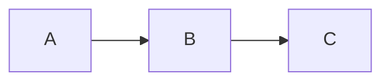

# glowm

Terminal markdown renderer with mermaid diagram support.

## Usage

```bash
# From file
glowm README.md

# From stdin
cat README.md | glowm
echo "# Hello **world**" | glowm
```

## Features

### Mermaid Diagrams

Converts mermaid code blocks to ASCII art using [beautiful-mermaid](https://github.com/nicober/beautiful-mermaid).

````markdown

````

### Syntax Highlighting

Code blocks with language tags are wrapped in box-drawing borders with language label. Uses VS Code Dark+ terminal colors.

````markdown
```typescript
const x = 1
```
````

Renders as:

```
┌─ typescript ──┐
│               │
│  const x = 1  │
│               │
└───────────────┘
```

### Task Lists

Checkboxes render with `[✓]` for completed items:

```markdown
- [x] Done
- [ ] Pending
```

### Blockquotes

Blockquotes display with a left half block pipe and dimmed italic text:

```markdown
> This is a quote
```

Renders as:

```
▌  This is a quote
```

### Inline Formatting

- **Bold** renders with ANSI bold
- *Italic* renders with ANSI italic
- ~~Strikethrough~~ renders with muted color
- `code` renders with red on dark background
- [Links](url) render in blue

### Headings

H1 headings render as pill-style labels (black text on blue background, padded, no `#` prefix). Other headings render in cyan bold.

### Indentation

Paragraphs and headings are indented for better readability.
