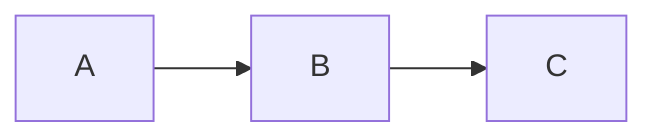

# glowm

Terminal markdown renderer with mermaid diagram support.

## Usage

```bash
# From file
glowm README.md

# From stdin
cat README.md | glowm
echo "# Hello **world**" | glowm
```

## Features

### Mermaid Diagrams

Converts mermaid code blocks to ASCII art using [beautiful-mermaid](https://github.com/nicober/beautiful-mermaid).

````markdown

````

### Syntax Highlighting

Code blocks with language tags are wrapped in box-drawing borders. Uses VS Code Dark+ terminal colors.

````markdown
```typescript
const x = 1
```
````

Renders as:

```
┌───────────────┐
│               │
│  const x = 1  │
│               │
└───────────────┘
```

### Task Lists

Checkboxes render with `[✓]` for completed items:

```markdown
- [x] Done
- [ ] Pending
```

### Blockquotes

Blockquotes display with a colored vertical pipe:

```markdown
> This is a quote
```

Renders as:

```
│  This is a quote
```

### Inline Formatting

- **Bold** text renders with ANSI bold
- `code` renders with red on dark background
- [Links](url) render in blue
- *Italic* text renders with ANSI italic

### Indentation

Paragraphs and headings are indented for better readability.

## Installation

```bash
# Clone and link
cd ~/.dotfiles/tools/glowm
bun install
bun link
```

## Development

```bash
bun run start         # Run CLI
bun run test          # Run tests
bun run typecheck     # Type check
```

## Theme

Uses VS Code Dark+ terminal colors:

| Element     | Color   |
|-------------|---------|
| Heading     | Green   |
| Code        | Red     |
| Link        | Blue    |
| Blockquote  | Cyan    |
| First H1    | Magenta background |
