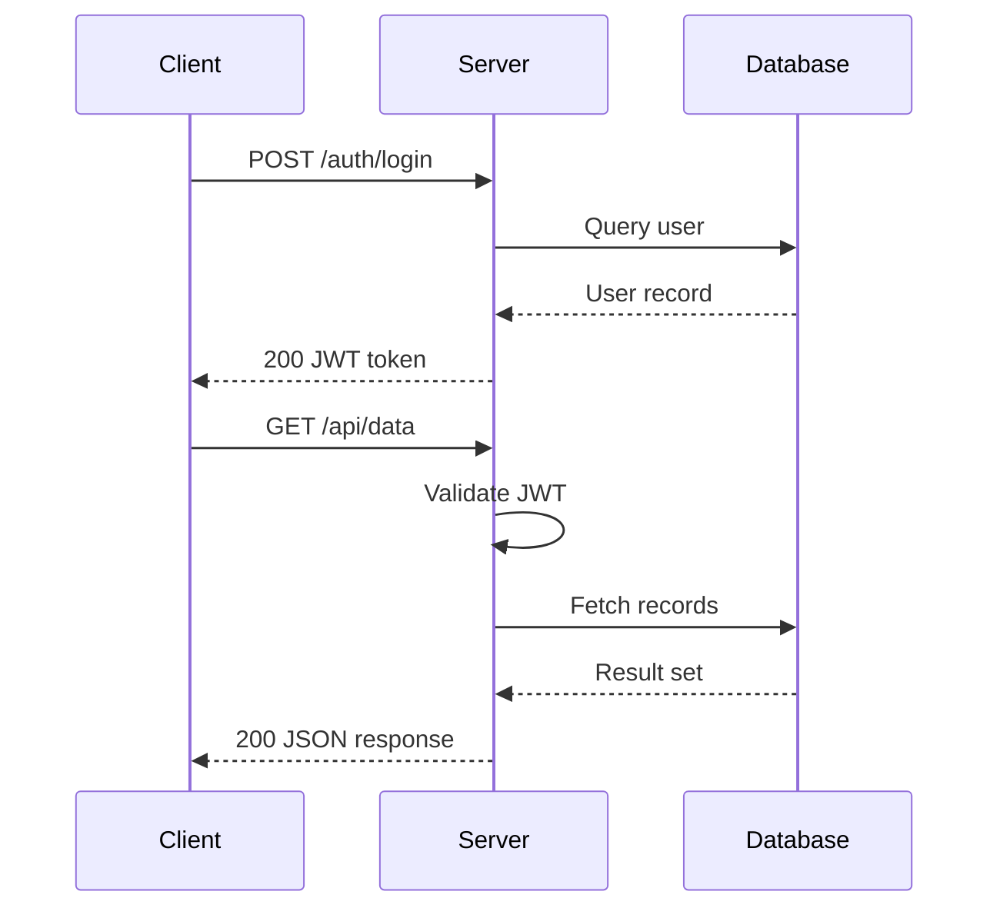
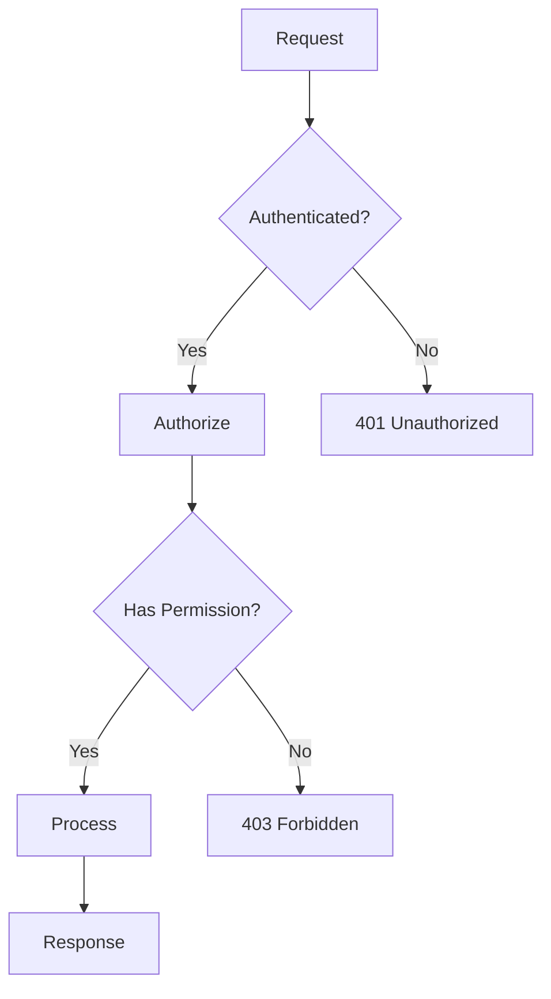

# Primary Heading

## Secondary Heading

### Tertiary Heading

Regular paragraph text with **bold emphasis** and *italic emphasis* and ~~strikethrough~~ inline.

Inline code: `const server = createServer()` and `pnpm install` in a sentence.

> Blockquote text stands apart from the main flow.
> Multiple lines of quoted material.

---

- **Bold** in a list item
- Uses `inline code` in a list
- [Link text](https://example.com) in a list
- Mixed: **bold**, `code`, and *italic* together
- Plain list item

1. First ordered item with `code`
2. Second with **emphasis**
3. Third plain

- [x] **Completed** task
- [ ] Pending task with `details`

```typescript
import { createServer } from "node:http"

const server = createServer((req, res) => {
  res.writeHead(200, { "Content-Type": "text/plain" })
  res.end("Hello World")
})

server.listen(3000)
```

[Visit the docs](https://example.com/docs) for more information.




